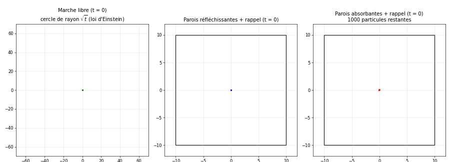
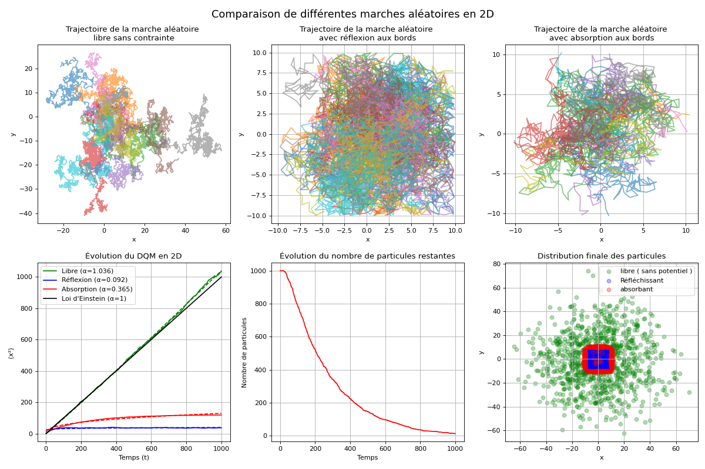
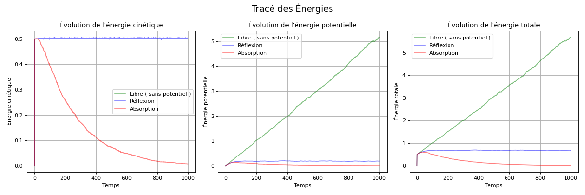

# Marches aléatoires en 2D : diffusion libre, confinée et absorbée

Simulation de 1000 particules effectuant des marches aléatoires dans le plan, dans trois situations : **libres**, **confinées** dans une boîte à parois réfléchissantes, ou dans une boîte à parois **absorbantes**, avec dans les deux derniers cas une force de rappel vers le centre. On mesure le **déplacement quadratique moyen**, l'exposant et le coefficient de diffusion, les énergies et le nombre de particules survivantes.



*Les 1000 particules au cours des 1000 pas (une image tous les 5 pas). À gauche, le nuage s'étale librement ; le cercle, de rayon √t, suit la distance quadratique moyenne prévue par la loi d'Einstein. Au centre, le nuage reste confiné dans la boîte. À droite, les particules absorbées restent figées en gris sur les parois et le nombre de survivantes diminue.*

> **En bref**
> - Marche libre : $\langle r^2 \rangle$ croît linéairement avec le temps ($\alpha \approx 1$) avec $D \approx 0{,}26$, conformément à la loi d'Einstein qui prédit $D = 0{,}25$.
> - Parois réfléchissantes et force de rappel : le DQM sature vers 37, la diffusion est bloquée ($\alpha \approx 0{,}1$).
> - Parois absorbantes : les particules disparaissent de façon quasi exponentielle, avec un temps caractéristique d'environ 200 pas.

## 1. Objectif

Étudier comment les **conditions aux bords** et un **potentiel de confinement** modifient la diffusion de particules browniennes, en comparant les simulations aux lois théoriques de la diffusion.

## 2. Théorie de la diffusion

### Loi d'Einstein

En 1905, Einstein relie le mouvement brownien à la diffusion : le déplacement quadratique moyen croît **linéairement** avec le temps. En dimension $d$ :

$$\langle r^2(t) \rangle = 2d\thinspace D\thinspace t \qquad \text{soit} \qquad \langle r^2(t) \rangle = 4Dt \ \text{en 2D}$$

où $D$ est le coefficient de diffusion.

Pour une marche à pas de longueur fixe $\delta$ dans une direction aléatoire, les pas successifs sont indépendants et de moyenne nulle : leurs carrés s'ajoutent, d'où $\langle r^2(t) \rangle = t\thinspace\delta^2$ (en nombre de pas). En identifiant avec $4Dt$, on obtient :

$$D = \frac{\delta^2}{4} = 0{,}25 \quad \text{pour } \delta = 1$$

### Diffusion anormale

On ajuste le DQM par une loi de puissance $\langle r^2 \rangle = C\thinspace t^\alpha$ :

- $\alpha = 1$ : diffusion normale ;
- $\alpha > 1$ : superdiffusion ;
- $\alpha < 1$ : sous-diffusion, par exemple en présence de confinement ou d'obstacles. C'est le cas qui nous intéresse avec les boîtes.

## 3. Le modèle

### Les trois marches

Toutes les particules partent de l'origine. À chaque pas, chacune tire un angle $\theta$ uniforme dans $[0, 2\pi[$ et se déplace de $\delta = 1$ dans cette direction.

| Marche | Force de rappel | Parois de la boîte $[-10, 10]^2$ |
|---|---|---|
| Libre | non | aucune |
| Réfléchissante | oui | la particule qui sort voit son pas inversé dans la direction concernée |
| Absorbante | oui | la particule qui sort est absorbée : elle s'arrête et ne compte plus dans les énergies |

### Force de rappel harmonique

Dans les deux boîtes, un potentiel harmonique attire les particules vers le centre. À chaque pas, un déplacement supplémentaire $-k\thinspace\vec r$ s'ajoute au pas aléatoire :

$$\vec r_{t+1} = (1 - k)\thinspace\vec r_t + \vec\xi_t, \qquad k = 0{,}01$$

C'est une version discrète du **processus d'Ornstein-Uhlenbeck** : une diffusion rappelée vers un point d'équilibre. Sans parois, le DQM sature à une valeur finie :

$$\langle r^2 \rangle_\infty = \frac{\delta^2}{1 - (1 - k)^2} \approx 50$$

avec un temps de relaxation de l'ordre de $1/(2k) = 50$ pas.

### Énergies

Les énergies sont définies à partir du déplacement par pas, assimilé à une vitesse ($m = 1$) :

$$E_c = \tfrac{1}{2} m v^2, \qquad E_p = \tfrac{1}{2} m k\thinspace (x^2 + y^2)$$

Elles sont moyennées sur les particules ; une particule absorbée a une énergie nulle.

## 4. Implémentation

Toutes les particules sont mises à jour en même temps par des opérations NumPy : seul le temps fait l'objet d'une boucle.

| Fonction | Rôle |
|---|---|
| `random_walk_free` | marche libre |
| `random_walk_reflecting_2D` | force de rappel et réflexion aux parois (masques booléens sur les particules sorties) |
| `random_walk_absorption_2D` | force de rappel, absorption aux parois (tableau booléen des particules actives), énergies et nombre de survivantes |
| `compute_DQM` | $\langle r^2(t) \rangle$ moyenné sur toutes les particules |
| `power_law` + `scipy.optimize.curve_fit` | ajustement $C\thinspace t^\alpha$ pour extraire l'exposant $\alpha$ |

Le coefficient de diffusion est estimé par la pente du DQM, $D = \Delta\langle r^2 \rangle / (4\thinspace\Delta t)$, sur la seconde moitié de la simulation (entre les pas 50 et 200 pour la marche réfléchissante, avant la saturation complète). Les courbes de DQM sont lissées par un filtre gaussien pour l'affichage.

| Paramètre | Valeur | Rôle |
|---|---|---|
| `N` | 1000 | nombre de particules |
| `T` | 1000 | nombre de pas |
| `delta` | 1 | longueur d'un pas |
| `box_size` | 20 | côté de la boîte, parois en $x, y = \pm 10$ |
| `k` | 0,01 | raideur de la force de rappel |
| `m` | 1 | masse |

## 5. Résultats



*En haut : trajectoires de 10 particules pour chaque type de marche. En bas : déplacement quadratique moyen (DQM) et ajustements en loi de puissance, nombre de particules restantes dans la boîte absorbante, positions finales des 1000 particules.*

La graine aléatoire est fixée : chaque exécution redonne exactement les valeurs ci-dessous.

### Marche libre

- $\alpha \approx 1{,}04$ et $D \approx 0{,}26$, contre 1 et 0,25 en théorie : la loi d'Einstein est vérifiée. Après 1000 pas, $\langle r^2 \rangle \approx 1000$, soit une distance typique à l'origine de $\sqrt{1000} \approx 32$ pas.
- $E_c = 0{,}5$ constante, puisque chaque pas a une longueur exactement égale à 1.
- $E_p = \tfrac{1}{2}k\langle r^2 \rangle$ croît linéairement, jusqu'à environ 5 à la fin : les particules s'éloignent du centre sans contrainte.

### Parois réfléchissantes

- Le DQM **sature** vers 37 en une centaine de pas : $\alpha \approx 0{,}09$, la diffusion est bloquée. Le potentiel seul limiterait le DQM à environ 50 ; les parois en $\pm 10$ coupent les excursions les plus lointaines et abaissent encore cette valeur.
- Les énergies atteignent rapidement un plateau : $E_c \approx 0{,}5$ et $E_p = \tfrac{1}{2}k\langle r^2 \rangle \approx 0{,}19$. Le système atteint un état stationnaire, où la diffusion vers l'extérieur et le rappel vers le centre s'équilibrent.

### Parois absorbantes

- **Particules survivantes** : 788 après 100 pas, 342 après 300, 148 après 500, 14 après 1000. Après une courte phase où les particules n'ont pas encore atteint les parois, la décroissance est quasi exponentielle, avec un temps caractéristique d'environ 200 pas : chaque particule encore présente a, à chaque pas, à peu près la même probabilité de s'échapper.
- **Énergies** : elles décroissent avec le nombre de survivantes et s'annulent quand toutes ont été absorbées.
- **DQM et exposant ($\alpha \approx 0{,}37$)** : le DQM est moyenné sur **toutes** les particules, y compris les absorbées. Celles-ci restent immobiles à l'endroit où elles ont franchi une paroi, donc à au moins 10 du centre ($r^2 \ge 100$). À mesure que les absorptions s'accumulent, le DQM croît vers ces grandes valeurs (≈ 120 à la fin), alors que les 14 survivantes restantes ont un $\langle r^2 \rangle$ d'environ 24 seulement. L'exposant mesuré reflète donc surtout la progression des absorptions, pas la diffusion des particules encore actives.

## 6. Limites et pistes

- **DQM de la marche absorbante** : le calculer uniquement sur les particules encore actives décrirait mieux leur diffusion, et la distribution des temps d'absorption (temps de premier passage) est une grandeur intéressante en soi.
- **Énergies** : une marche aléatoire n'a pas d'inertie ; l'« énergie cinétique » définie à partir du déplacement par pas est une convention utile pour comparer les marches, pas une énergie physique au sens de la mécanique.
- **Réflexion** : inverser le pas est une approximation ; une réflexion par symétrie par rapport à la paroi serait plus exacte pour des pas longs.
- **Comparaison analytique** : le processus d'Ornstein-Uhlenbeck et la diffusion dans une boîte absorbante ont des solutions exactes (équation de Fokker-Planck) auxquelles comparer les histogrammes de positions et la décroissance du nombre de survivantes.
- **Extensions** : passage en 3D, interactions entre particules pour simuler un fluide qui diffuse.

## 7. Lancer le code

```bash
pip install -r requirements.txt
python marches_aleatoires.py            # résultats dans le terminal, figures et animation
python marches_aleatoires.py --sauver   # enregistre les figures et l'animation dans figures/
```

Les énergies sont tracées dans une seconde figure :



## 8. Références

- A. Einstein, *Über die von der molekularkinetischen Theorie der Wärme geforderte Bewegung von in ruhenden Flüssigkeiten suspendierten Teilchen*, Annalen der Physik 17, 549 (1905).
- G. E. Uhlenbeck et L. S. Ornstein, *On the theory of the Brownian motion*, Physical Review 36, 823 (1930).
- S. Redner, *A Guide to First-Passage Processes*, Cambridge University Press (2001).

---

Projet réalisé en L3 Physique à CY Cergy Paris Université (cours « Projet numérique », février 2025).
